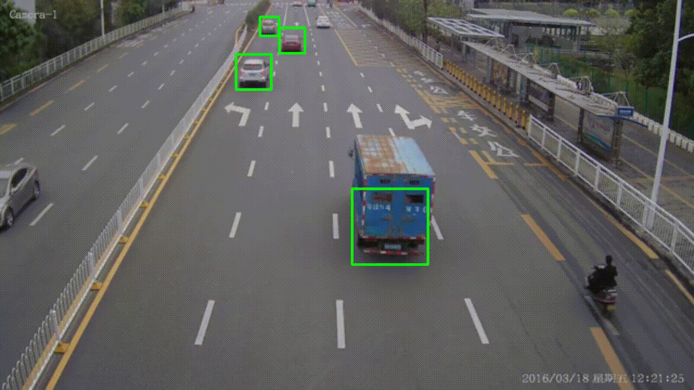

# 🚗 VAST – Vehicle Analysis & Speed Tracking

[VAST (Vehicle Analysis & Speed Tracking)](https://github.com/coddingjatin/VAST-Smart-Vehicle-Tracking.git) is a smart computer vision-based solution that detects vehicles, tracks them across video frames, and estimates their speed using pixel-based distance calculations.  
Built using **Python, OpenCV, and dlib**, this project is ideal for smart traffic systems, surveillance, and transport research.

---

## 🛠 Technologies Used

- 🐍 Python  
- 📷 OpenCV  
- 📌 dlib (for vehicle tracking)  
- 🧠 Haarcascade Classifier (vehicle detection)

---

## ⚙️ Features

### ✅ Vehicle Detection
- Detects vehicles using Haarcascade classifiers.

### 🔁 Vehicle Tracking
- Assigns unique IDs and tracks each vehicle using **correlation tracker** from dlib.

### 📏 Speed Estimation
- Calculates vehicle speed by tracking pixel movement per second.
- Converts pixel distance to meters using manually calibrated **pixels-per-meter (ppm)**.
- Final speed (in km/h) = `d_meters * fps * 3.6`
  
### 📊 Speed Calculation Explained
- Manually estimate road width in meters
- Measure the road width in pixels from video
- Calculate ppm (pixels-per-meter) = `pixels / meters`
- Track vehicle pixel movement across frames (d_pixels)
- Convert to meters: `d_meters = d_pixels / ppm`
- Estimate speed:
`m/s = d_meters * fps` &
`km/h = d_meters * fps * 3.6`

- ⚠️ Each video may need custom ppm based on camera angle and road.
---

## 📁 Project Structure
```
VAST-Smart-Vehicle-Tracking/
├── cars.mp4
├── output.gif
├── output.mp4
├── requirements.txt
├── readme.md     
└── main.py   
```
## 🧑‍🏫 Demo 
<p align="center">
  
  <br/>
  <em>VAST: Real-time Vehicle Detection & Speed Tracking</em>
</p>

## 🚀 How to Run

```bash
# 1. Clone the repository
git clone https://github.com/coddingjatin/VAST-Smart-Vehicle-Tracking.git

# 2. Navigate to project folder
cd VAST-Smart-Vehicle-Tracking

# 3. Create a virtual environment
python -m venv venv

# 4. Activate the virtual environment
# On Windows:
venv\Scripts\activate
# On Mac/Linux:
source venv/bin/activate

# 5. Install dependencies
pip install -r requirements.txt

# 6. Run the project
python main.py
```
---

## 🌟 Show Some Love

- If you like this project, consider giving it a ⭐  
- It motivates us to keep building impactful tech! and you're welcome to modify or extend it for your own or educational purposes.

---

## 📄 License

MIT License. See [LICENSE](LICENSE) for details.

---
